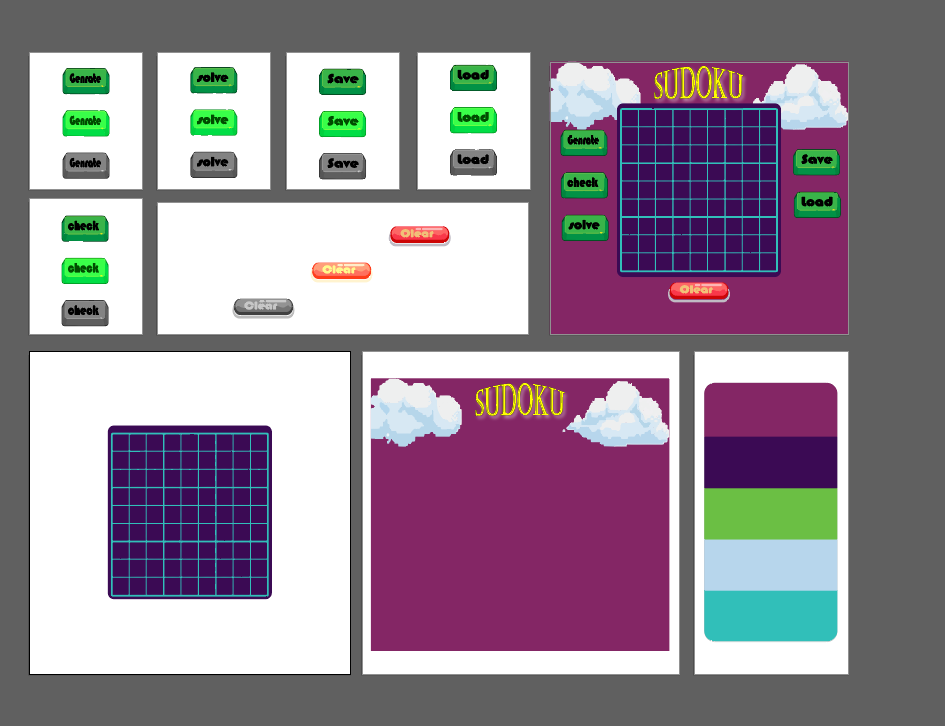
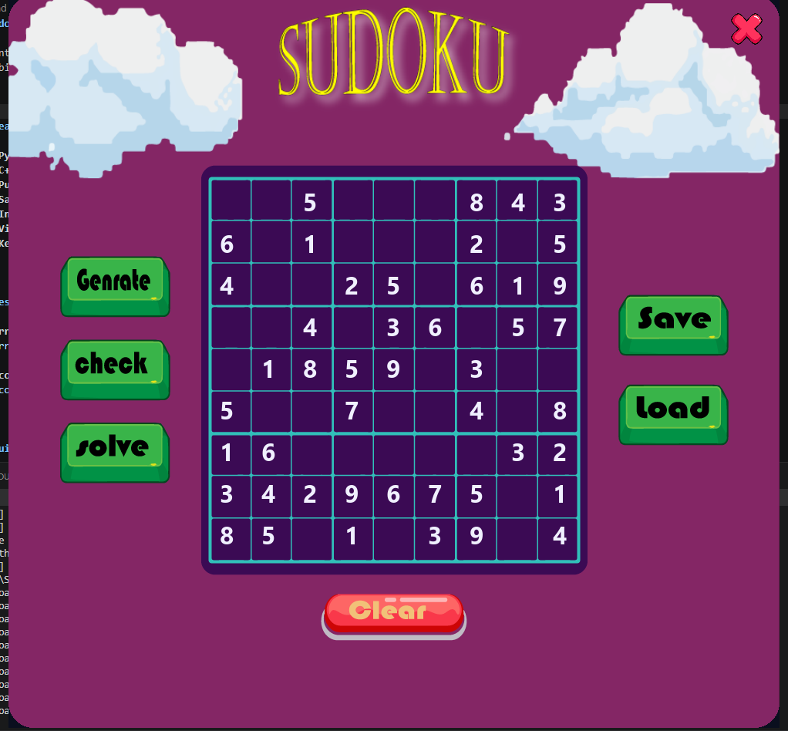

# Sudoku Game

An interactive Sudoku game built with **Python Pygame** frontend and **C++ backend logic**. Features puzzle generation, solving capabilities, persistent state management, and comprehensive input validation.

---

## Features

- **Pygame GUI** - Responsive graphical interface with interactive game board
- **C++ Solver** - Efficient backtracking algorithm for puzzle solving
- **Puzzle Generation** - Multiple difficulty levels (Easy, Medium, Hard)
- **Save & Load** - Persist and restore game progress
- **Input Validation** - Real-time feedback on move legality
- **Visual Feedback** - Clear error messages and validation status
- **Keyboard Controls** - Navigation and cell selection via keyboard

---

## Design Overview

**Current Working Design:**


**Final Design:**


---

## Quick Start

### Prerequisites
- Python 3.7+
- Pygame
- Windows (compiled C++ DLL included)

### Installation

1. **Clone or download the repository:**
   ```powershell
   cd D:\Kolya\Softwarecourse\SodukuCode
   ```

2. **Install dependencies:**
   ```powershell
   pip install pygame
   ```

3. **Run the game:**
   ```powershell
   python sudoku_game.py
   ```

The game window will launch with the initial puzzle loaded.

---

## Game Controls

| Input | Action |
|-------|--------|
| **Click Cell** | Select a cell for editing |
| **Arrow Keys** | Navigate between cells |
| **1-9** | Place number in selected cell |
| **Delete / Backspace / 0** | Clear the selected cell |
| **Escape** | Deselect current cell |
| **Generate Button** | Create a new random puzzle |
| **Check Button** | Verify if current solution is valid |
| **Solve Button** | Auto-solve the puzzle |
| **Save Button** | Save game state to file |
| **Load Button** | Load previously saved game |
| **Clear Button** | Clear all user entries (keep puzzle) |
| **Exit Button** | Quit the game |

---

## Input Validation

The game implements a robust validation system to ensure moves follow Sudoku rules:

```
User Input (1-9)
       ↓
Is the cell fixed (blue)?
├─ YES → Toast: "Cannot modify fixed cell!" ❌
└─ NO → Continue
       ↓
Is the cell already filled?
├─ YES → Toast: "Cell already has X! Clear first." ❌
└─ NO → Continue
       ↓
Does the move follow Sudoku rules?
├─ YES → Place number ✓
└─ NO → Toast: "Invalid! X conflicts with row/column/box" ❌
```

### Example Scenarios

**Valid Move:**
```
Click empty cell → Press 5
Result: Number 5 placed successfully
Console: [Debug] Placed 5 at (2, 3)
```

**Protected Cell (Blue):**
```
Click fixed cell with '8' → Press 3
Result: Toast: "Cannot modify fixed cell!"
Reason: Pre-filled puzzle clues are protected
```

**Cell Already Filled:**
```
Cell contains 7 (you placed it) → Press 2
Result: Toast: "Cell already has 7! Clear first."
Action: Press Delete → Then press 2
```

**Sudoku Rule Violation:**
```
Row 0 already has 8 → Try to place 8 in row 0
Result: Toast: "Invalid! 8 conflicts with row/column/box"
Reason: Sudoku rules prevent duplicates
```

---

## Project Structure

```
SodukuCode/
├── README.md                      # This file
├── INSTRUCTIONS.md                # Detailed troubleshooting guide
├── sudoku_game.py                 # Main Pygame GUI application
├── sudoku_binding.py              # C++ to Python ctypes bindings
├── sudoku_save.json               # Saved game state
├── assets/                        # Game assets (images, fonts)
│
└── sudoku-game-1/                 # C++ Backend Project
    ├── CMakeLists.txt             # CMake configuration
    ├── Makefile                   # Build configuration
    ├── README.md                  # C++ project documentation
    │
    ├── src/                       # Source files
    │   ├── main.cpp               # Entry point (console mode)
    │   ├── Sudoku.cpp/h           # Core sudoku board class
    │   ├── SudokuSolver.cpp/h     # Backtracking solver
    │   ├── SudokuAPI.cpp/h        # C++ <-> Python interface (DLL export)
    │   ├── PuzzleGenerator.cpp/h  # Random puzzle generation
    │   ├── Validator.cpp/h        # Move validation
    │   └── FileHandler.cpp/h      # File I/O operations
    │
    ├── puzzles/                   # Pre-made puzzles
    │   ├── easy.txt
    │   ├── medium.txt
    │   └── hard.txt
    │
    └── saved/                     # User-saved puzzles directory
```

---

## Architecture

### Python Layer (GUI)
- **sudoku_game.py** - Pygame GUI handling rendering, input, and game state
- **sudoku_binding.py** - Ctypes bindings to call C++ DLL functions

### C++ Layer (Logic)
- **SudokuBoard (Sudoku.cpp)** - Represents the 9x9 grid state
- **SudokuSolver** - Solves puzzles using backtracking algorithm
- **PuzzleGenerator** - Creates random puzzles with unique solutions
- **Validator** - Checks move legality and solution validity
- **FileHandler** - Loads/saves puzzles from text files
- **SudokuAPI** - Exports functions to Python via DLL

### Data Flow
```
Pygame GUI Input
       ↓
Validation (C++)
       ↓
Board Update (C++)
       ↓
Render (Pygame)
```

---

## Building the C++ Backend

If you modify the C++ code, rebuild the DLL:

### Using CMake:
```powershell
cd sudoku-game-1
mkdir build
cd build
cmake ..
cmake --build . --config Release
```

### Using Makefile:
```powershell
cd sudoku-game-1
make
```

The compiled DLL will be available for the Python layer.

---

## Save/Load Game State

Games are saved as JSON files in the project root:

```json
{
  "board": [[8, 0, 0, ...], ...],
  "puzzle": [[8, 0, 0, ...], ...],
  "selected_cell": [0, 0]
}
```

**Save:** Click "Save" button to persist current game state  
**Load:** Click "Load" button to restore previous game

---

## Troubleshooting

### Issue: "Could not import sudoku_binding module"
**Solution:** Ensure `SudokuGame.dll` is built and in the project directory.
```powershell
# Rebuild C++ project
cd sudoku-game-1
make clean
make
```

### Issue: No visual feedback when placing numbers
**Solution:** The console shows `[Debug]` messages. Check console output for validation details.

### Issue: Puzzle won't load
**Solution:** Verify puzzle file format (9x9 grid with 0 for empty cells).

For more troubleshooting, see [INSTRUCTIONS.md](INSTRUCTIONS.md).

---

## Files Reference

| File | Purpose |
|------|---------|
| `sudoku_game.py` | Main game loop and Pygame GUI |
| `sudoku_binding.py` | Python ↔ C++ interface |
| `sudoku_save.json` | Persistent game save data |
| `INSTRUCTIONS.md` | Detailed guide and troubleshooting |

---

## Learning Resources

This project demonstrates:
- **GUI Development** - Pygame framework and event handling
- **Performance Optimization** - C++ backend for computational work
- **Language Interoperability** - Python/C++ integration via ctypes
- **Algorithm Design** - Backtracking solver implementation
- **Game Architecture** - Clean separation between logic and presentation

