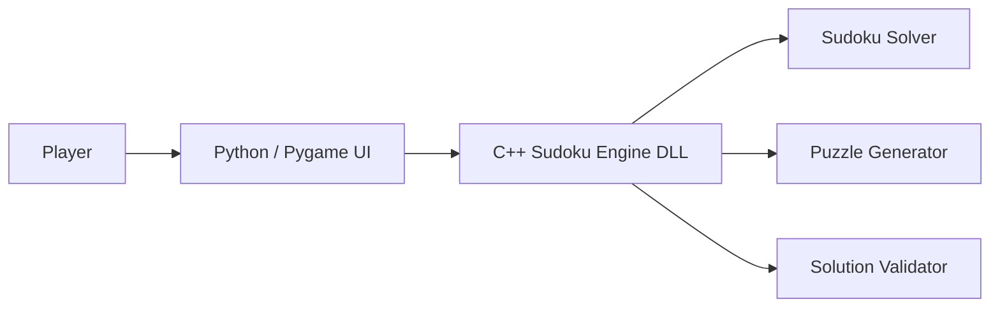

# Sudoku Game

A desktop Sudoku application developed as a two-layer software architecture project. The graphical user interface is implemented in Python using Pygame, while the puzzle generation, validation, and solving engine is implemented in C++ and exposed to Python through a compiled DLL.

<p align="left">
  
  
  
  
  
</p>


## Overview

This project demonstrates cross-language software development by combining a Python-based graphical interface with a high-performance C++ backend.

The application allows users to:

* Generate Sudoku puzzles
* Enter and edit solutions
* Validate puzzle states
* Automatically solve puzzles
* Save and load progress
* Interact through a responsive graphical interface

The architecture follows a clear separation of concerns:

* Python handles presentation and user interaction.
* C++ handles puzzle generation, validation, and solving.
* Communication is achieved through a dynamically linked library (DLL) loaded with Python's `ctypes` module.


## Gallery

### Design Evolution

<table>
<tr>
<td align="center" width="50%">
<b>Initial Design</b><br><br>

</td>
<td align="center" width="50%">
<b>Final Design</b><br><br>

</td>
</tr>
</table>

The interface evolved from an early prototype into a polished and user-friendly Sudoku experience while preserving the underlying game engine and architecture.


## System Architecture



The frontend communicates directly with the C++ engine through DLL function calls, allowing computationally intensive operations to remain isolated from the user interface layer.


## Features

* Interactive Sudoku board
* Keyboard and mouse controls
* Puzzle generation
* Solution validation
* Automatic puzzle solving
* Save and load functionality
* Clear board functionality
* Cross-language integration using Python and C++
* Modular two-layer architecture


## Controls

| Input              | Action                         |
| ------------------ | ------------------------------ |
| Mouse Click        | Select a cell                  |
| Arrow Keys         | Move between cells             |
| Keys 1–9           | Enter a value                  |
| Delete / Backspace | Clear selected cell            |
| Escape             | Deselect current cell          |
| Generate           | Create a new puzzle            |
| Check              | Validate the current solution  |
| Solve              | Automatically solve the puzzle |
| Save               | Save game progress             |
| Load               | Restore saved progress         |
| Clear              | Remove user-entered values     |


## Project Structure

```text
Sudoku-Game/
├── sudoku_game.py
├── sudoku.dll
├── predesign.png
├── desgin.png
├── savegame.txt
├── assets/
│   ├── fonts/
│   ├── icons/
│   └── images/
└── README.md
```

### Main Components

| Component        | Responsibility                           |
| ---------------- | ---------------------------------------- |
| `sudoku_game.py` | Main application and graphical interface |
| `sudoku.dll`     | C++ backend library                      |
| Solver Module    | Solves Sudoku puzzles                    |
| Generator Module | Generates valid Sudoku puzzles           |
| Validator Module | Validates player solutions               |
| `savegame.txt`   | Stores saved game progress               |
| `assets/`        | Visual resources used by the interface   |


## Technologies Used

| Technology | Purpose                                |
| ---------- | -------------------------------------- |
| Python     | User interface and application control |
| Pygame     | Graphics rendering and input handling  |
| C++        | Puzzle generation and solving logic    |
| DLL        | Language interoperability layer        |
| ctypes     | Communication between Python and C++   |


## Installation

### Requirements

* Python 3.7 or later
* Pygame
* Windows operating system

Install dependencies:

```bash
pip install pygame
```


## Running the Application

```bash
python sudoku_game.py
```

The application automatically loads the compiled C++ DLL and connects it to the graphical interface.


## Software Engineering Concepts Demonstrated

* Layered Architecture
* Separation of Concerns
* Modular Design
* Python–C++ Interoperability
* Dynamic Link Libraries (DLL)
* GUI Development
* Event-Driven Programming
* Algorithm Design
* Data Validation
* Persistent Storage


## Key Learning Outcomes

This project was developed as part of a Software Engineering course and focuses on:

* Designing maintainable software architectures
* Integrating components written in different programming languages
* Building graphical desktop applications
* Implementing Sudoku generation and solving algorithms
* Managing communication between frontend and backend systems


## Author

Adham Ayman Mohamed

## License

Created for educational purposes as part of a Software Engineering course project.
